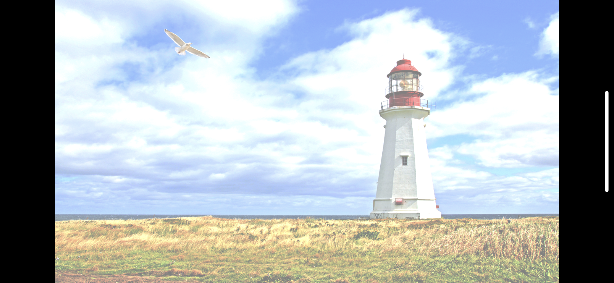
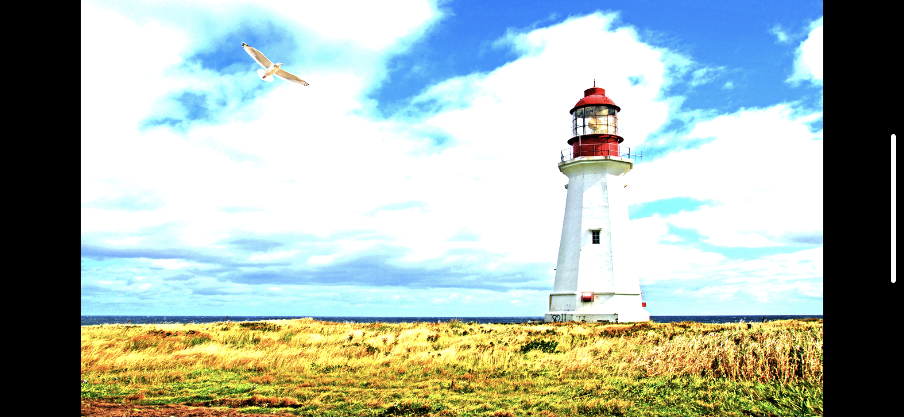
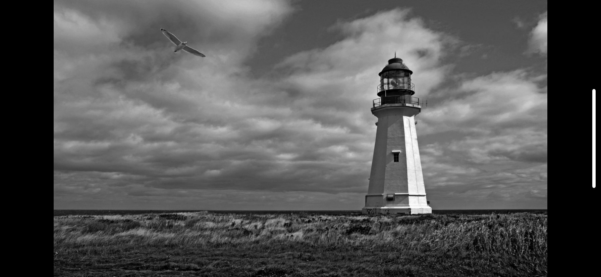
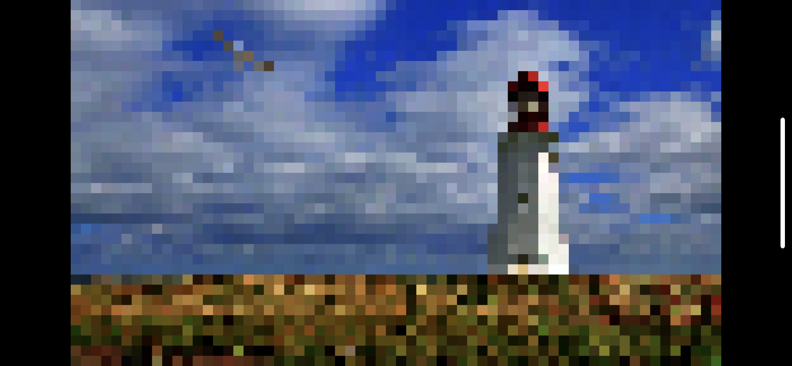
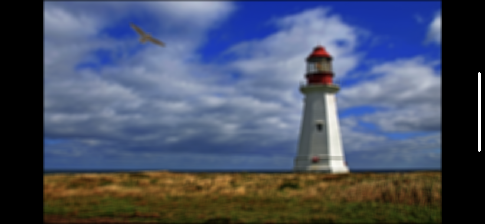

<h3 align="center">
  
</h3>

# Metal Camera

Basic **Swift** implementation of the iOS video camera that uses **GPU Shaders** implemented with **Metal Shading Language**.

Check out corresponding Medium article: [Easy Filters - Intro to GPU Pixel Shaders](https://towardsdatascience.com/easy-filters-intro-to-gpu-pixel-shaders-156dac92b895)

---

iOS app implemented with shaders from this project:

## Shaders

* **Passthrough (Original)** 

---

* **Brightness** 

---

* **Contrast** 

---

* **Gamma** 

---

* **Exposure** 

---

* **Grayscale** 

---

* **Inversion** 

---

* **Rgba2Bgra** 

---

* **Pixellate** 

---

* **BoxBlur** 

---

## Author

**Greg (Grzegorz) Surma**

[**PORTFOLIO**](https://gsurma.github.io)

[**GITHUB**](https://github.com/gsurma)

[**BLOG**](https://medium.com/@gsurma)

